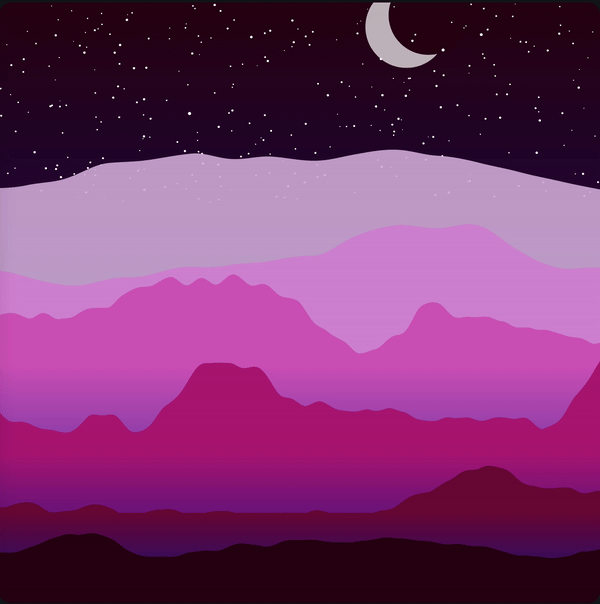
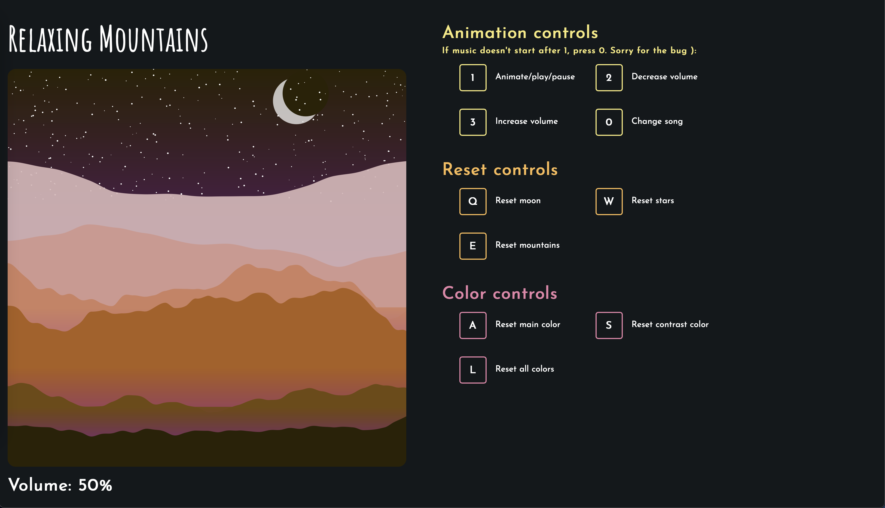

# Creative Coding Assignments
## Overview
I took Creative Coding because I was really interested in ways that I could use these programming skills that I have learned through college. As a computer science major most of the coursework that we do is theory based with our assignments based on the logic of our code with the way it is presented as a secondary thought. I've always been interested in art, so this class sounded really exciting because we would be working with a lot of front end technologies.

This course introduced us to the Processing GUI library for Java and the p5.js library for JavaScript. I had spent a few months learning HTML, CSS, and some JavaScript for this course and I hope to practice those skills and learn some more along the way!

## Assignment 1
[Live link](https://pensive-nobel-5f3f2c.netlify.app/)

Originally I had intended to re-make the Google Chrome dino game (now Assignment 2), but I was still getting used to the language and realized I was probably a little ambitious.

I decided to make a sketch inspired by the DVD logo. The inspiration came from this [link](https://bouncingdvdlogo.com).

For this assignment I used p5.js and attached my canvas to a regular HTML file with a little bit of CSS styling.

## Assignment 2
[Live link](https://admiring-rosalind-940628.netlify.app/)

After spending more time learning JavaScript and the p5.js library I felt I was ready to tackle a project quite more complex than my first assignment. I learned a lot about using the order of the layers that you render to create the scene how you like it. While learning JavaScript I learned about its natural behavior to hoist function declarations. I had used this behavior in my assignment because it made the code easier to work with when all the supporting functions were below the main draw function, however I had read that this is bad practice. I hope as I learn more JavaScript that I learn better practices to write more maintainable and readable code.

This assignment also used p5.js attached to an HTML file with some CSS styling.

## Assignment 3
[Live link](https://hopeful-heyrovsky-852f08.netlify.app)

Similar to my last project I added a motion aspect to it. I enjoy adding parallax effects to 2D images because they add more depth to the piece and it helps to create a more 3D effect on a 2D image. While this generative landscape is neat

It would be a lot better if it were integrated into a website. I realized that my previous sketch was interesting, but it wasn't presented in a very interesting way. For this project I decided to put some of my HTML and CSS skills to use.

The generated landscape reminded me of lofi, so I decided to create a lofi music player. It was a very fun assignment that I would love to return to in the future!